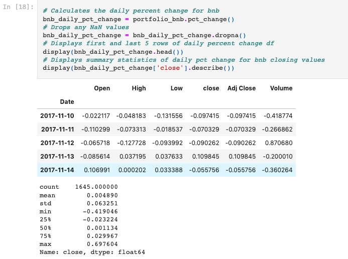

# Long_Term_Crypto_Portfolio_Projection
The construction and analysis of the past performance of a crypto currency portfolio as well as 1,3,5 year projections of its future earnings potential

---

## Technologies

This application is written in Python v. 3.9.7 and uses [JupyterLab](https://jupyter.org/) to deploy the code. This application makes use of
 the following libraries:

[numpy](https://numpy.org/doc/) was used for mathematical functions used in the analysis

[pathlib](https://docs.python.org/3/library/pathlib.html) was used to help import the csv file data

[pandas](https://pandas.pydata.org/docs/) was used for data collection, preparation, and analysis.

[yfinance](https://pypi.org/project/yfinance/) was used to gather the coin historical data

[hvplot](https://hvplot.holoviz.org/) was used to plot and visualize various data from the portfolio

[matplotlib](https://matplotlib.org/) was used to assist in plotting various data from the portfolio


---

## Installation Guide

Prior to running this application, perform the following in the command line to install the required libraries:

`pip install numpy`

`pip install pathlib`

`pip install pandas`

`pip install yfinance`

`pip install jupyterlab`

`pip install hvplot`

`pip install matplotlib`


---

## Usage

In order to launch the application, navigate to the Long_Term_Crypto_Portfolio_Projection folder that contains all of the code for this application, and then type into the command line:

```
jupyter lab
```

Once in jupyter lab, open the portfolio.ipynb file and run each cell in the jupyter file to see the resulting anlysis.

Below is an example of the resulting outputs of a cell being run in the jupyter notebook:




---

## Contributors

Robby Odum, Chance Griffin, Asia Perry, James Milan 

Emails: rodum012@gmail.com, griffc5@unlv.edu, asia.perry02@gmail.com, Cryptoklektik@gmail.com

---

## License

MIT
